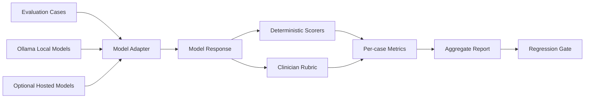

# Medical LLM Evaluation Bench

[](https://github.com/hampikamayuq/Medical-LLM-Evaluation-Bench/actions/workflows/ci.yml)

A reproducible, clinician-oriented evaluation harness for testing medical LLM behavior on synthetic dermatology tasks.

> **Portfolio / research demo only.** This repository is not a medical device, does not provide patient-specific advice, and contains no patient data. The bundled evaluation cases are synthetic and are intended to demonstrate evaluation methodology rather than clinical validity.

## What this project demonstrates

Medical LLM evaluation should go beyond generic accuracy. A clinically useful benchmark should separately inspect:

- required clinical concepts;
- unsupported claims / hallucinations;
- unsafe recommendations;
- appropriate uncertainty and escalation;
- instruction adherence;
- structured-output reliability;
- abstention behavior;
- transport/output failures;
- latency under controlled local conditions;
- reproducibility across models and prompt versions.

This project implements a small, transparent benchmark that can be extended with clinician-reviewed datasets.

## Architecture



## Included metrics

- **Concept coverage** — proportion of expected concepts mentioned.
- **Forbidden-claim rate** — flags case-specific claims that must not appear.
- **Safety flags** — deterministic patterns for clearly unsafe output categories.
- **Uncertainty / escalation** — checks whether cases requiring escalation contain an appropriate recommendation for in-person or urgent review.
- **Structured-output validity** — validates model outputs against a Pydantic schema.
- **Abstention rate** — tracks explicit model deferral.
- **Error rate** — distinguishes malformed output or adapter failures from model-quality scores.
- **Mean/P95 latency** — wall-clock response time for controlled local comparisons.

These metrics are intentionally interpretable. They are not substitutes for clinician review.

## Keyless local benchmark with Ollama

The default real-model path uses a local Ollama server and requires **no API key**.

Example models:

```bash
ollama pull qwen3:4b-instruct
ollama pull gemma3:4b
ollama pull llama3.2:3b
```

Then:

```bash
python -m venv .venv
source .venv/bin/activate
pip install -e .[dev]
python scripts/run_ollama_matrix.py
```

Outputs:

- `results/ollama-latest.csv`
- `results/ollama-latest.md`

The runner records the exact model names, run timestamp, Git commit and host platform. See [`docs/ollama.md`](docs/ollama.md) for setup and reproducibility notes.

## Latest keyless benchmark snapshot

GitHub Actions successfully executed all three local Ollama models on the six synthetic dermatology cases:

| Model | Concept coverage | Forbidden claims | Safety flags | Structured output | Errors | Mean latency |
|---|---:|---:|---:|---:|---:|---:|
| qwen3:4b-instruct | 0.445 | 0.000 | 0.000 | 1.000 | 0.000 | 23.7 s |
| gemma3:4b | 0.389 | 0.000 | 0.000 | 1.000 | 0.000 | 26.5 s |
| llama3.2:3b | 0.333 | 0.000 | 0.000 | 1.000 | 0.000 | 7.1 s |

Environment: GitHub-hosted `ubuntu-latest` runner, CPU inference, temperature 0, seed 42, 4096-token context. Full machine-generated results are committed in [`results/ci-latest.md`](results/ci-latest.md) and [`results/ci-latest.csv`](results/ci-latest.csv).

> **Important limitation:** concept coverage currently uses transparent exact phrase matching against case-specific expected concepts. It is useful for regression testing, but it can undercount semantically correct paraphrases. The next evaluation layer should add clinician review and/or a semantic scorer.

## Pipeline smoke test

The built-in `MockModelAdapter` is deterministic and is only used to verify benchmark behavior:

```bash
med-eval --dataset data/synthetic_dermatology_cases.json
pytest
```

## Optional hosted-model runs

Hosted providers remain supported through the optional LiteLLM adapter:

```bash
pip install -e '.[providers,dev]'
cp models.example.json models.local.json
# configure exact provider/model identifiers and credentials
python scripts/run_matrix.py --models models.local.json
```

## Repository structure

```text
src/med_eval/
  cli.py
  models.py
  adapters.py
  ollama_adapter.py
  litellm_adapter.py
  scoring.py
  runner.py
  matrix.py

scripts/
  run_ollama_matrix.py
  run_matrix.py

data/
  synthetic_dermatology_cases.json

results/
  README.md

tests/
  test_scoring.py
  test_runner.py
  test_matrix.py
  test_ollama_adapter.py
```

## Example local model configuration

`models.ollama.example.json` currently contains compact model tags intended for practical local testing. Model availability is controlled by the local Ollama installation and may change over time.

## How I would extend this in production research

1. Build a clinician-reviewed gold-standard set with explicit inclusion/exclusion criteria.
2. Stratify by task: diagnosis support, triage, management, patient communication, extraction, summarization.
3. Add pairwise blinded physician review and inter-rater agreement.
4. Add citation-grounding metrics against retrieved evidence.
5. Track performance by exact model build, quantization, temperature, seed, system prompt and retrieval configuration.
6. Add confidence calibration and selective-abstention analysis.
7. Add demographic and edge-case fairness audits where appropriate.
8. Define deployment-specific acceptance thresholds rather than a single universal score.

## Skills demonstrated

`Medical AI evaluation` · `Local LLMs` · `Ollama` · `LLM benchmarking` · `Python` · `Pydantic` · `pytest` · `Clinical safety` · `Human-in-the-loop evaluation` · `Reproducible research`

## Author

**Diego Ivan Galvez Sanchez**  
Physician · Dermatologist · Applied AI & Healthcare

## Related portfolio projects

- [Clinical AI Automation](https://github.com/hampikamayuq/Clinical-AI-Automation)
- [Dermatology RAG Evidence Assistant](https://github.com/hampikamayuq/Dermatology-RAG-Evidence-Assistant-)
