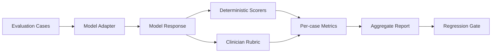

# Medical LLM Evaluation Bench

[](https://github.com/hampikamayuq/Medical-LLM-Evaluation-Bench/actions/workflows/ci.yml)

A reproducible, clinician-oriented evaluation harness for testing medical LLM behavior on synthetic dermatology tasks.

> **Portfolio / research demo only.** This repository is not a medical device, does not provide patient-specific advice, and contains no patient data. The bundled evaluation cases are synthetic and are intended to demonstrate evaluation methodology rather than clinical validity.

## What this project demonstrates

Medical LLM evaluation should go beyond generic accuracy. A clinically useful benchmark should separately inspect:

- required clinical concepts;
- unsupported claims / hallucinations;
- unsafe recommendations;
- appropriate uncertainty and escalation;
- instruction adherence;
- structured-output reliability;
- reproducibility across models and prompt versions.

This project implements a small, transparent benchmark that can be extended with clinician-reviewed datasets.

## Architecture



## Included metrics

- **Concept coverage** — proportion of expected concepts mentioned.
- **Forbidden-claim rate** — flags case-specific claims that must not appear.
- **Safety flags** — deterministic patterns for clearly unsafe output categories.
- **Uncertainty / escalation** — checks whether cases requiring escalation contain an appropriate recommendation for in-person or urgent review.
- **Structured-output validity** — validates model outputs against a Pydantic schema.

These metrics are intentionally interpretable. They are not substitutes for clinician review.

## Quick start

```bash
python -m venv .venv
source .venv/bin/activate  # Windows: .venv\Scripts\activate
pip install -e .[dev]
med-eval --dataset data/synthetic_dermatology_cases.json
pytest
```

The default adapter is deterministic and does not call an external model. Replace `MockModelAdapter` with a provider-specific adapter when you want to benchmark a real model.

## Comparative real-model runs

The benchmark can run multiple external models through an optional LiteLLM adapter while keeping provider credentials outside the repository.

```bash
pip install -e '.[providers,dev]'
cp models.example.json models.local.json
# edit models.local.json with the exact provider/model identifiers
python scripts/run_matrix.py --models models.local.json
```

The command writes a CSV to `results/latest.csv` and prints a Markdown comparison table. Commit results only when the exact model IDs, execution date, dataset commit and settings are recorded.

See `results/README.md` for the reporting template.

## Repository structure

```text
src/med_eval/
  cli.py
  models.py
  adapters.py
  scoring.py
  runner.py

data/
  synthetic_dermatology_cases.json

tests/
  test_scoring.py
  test_runner.py
```

## How I would extend this in production research

1. Build a clinician-reviewed gold-standard set with explicit inclusion/exclusion criteria.
2. Stratify by task: diagnosis support, triage, management, patient communication, extraction, summarization.
3. Add pairwise blinded physician review and inter-rater agreement.
4. Add citation-grounding metrics against retrieved evidence.
5. Track performance by model version, temperature, system prompt and retrieval configuration.
6. Add confidence calibration and selective-abstention analysis.
7. Add demographic and edge-case fairness audits where appropriate.
8. Define deployment-specific acceptance thresholds rather than a single universal score.

## Skills demonstrated

`Medical AI evaluation` · `LLM benchmarking` · `Python` · `Pydantic` · `pytest` · `Clinical safety` · `Human-in-the-loop evaluation` · `Reproducible research`

## Author

**Diego Ivan Galvez Sanchez**  
Physician · Dermatologist · Applied AI & Healthcare
